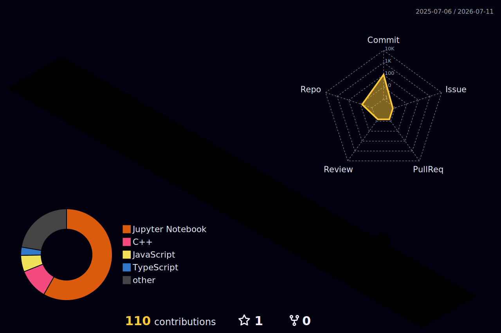

<h1 align="center">Hi, I'm Abdul Raffay 👋</h1>
<h3 align="center">🕵️ Genomic Detective — Turning Biological Mysteries Into Solvable Data Problems</h3>

  

  
  
  

---

### 🔍 <ins>The Investigator</ins>

Think of a doctor diagnosing an infection by symptoms — I do the same thing, except my patient is a genome and my symptoms are patterns in data. I'm a Bioinformatics student who treats biological problems like a detective treats a case: find the anomaly, trace it back to its cause, build a model that catches it next time. My foundation spans **bioinformatics software, biostatistics, and biophysics**, backed by solid **Linux** systems skills and a full-stack (**MERN**) development background. On top of that, I work with **Generative AI and Machine Learning**, and I'm now pushing further into **Deep Learning** — with the goal of bringing modern DL techniques into bioinformatics workflows that are still dominated by classical methods.

* 🧬 **The evidence I specialize in:** bioinformatics pipelines, biostatistics, biophysics — the biological grounding behind every model
* 🤖 **My method:** ML → GenAI → now Deep Learning, applied directly to genomic and biological datasets
* 🐧 **My base of operations:** Linux, from general use to full pipeline execution
* 🌐 **How I build the case files:** MERN stack — the dev skills that turn models into actual usable tools, not just notebooks
* 🎯 **The bigger case I'm working:** using AI/DL to reshape how bioinformatics research is done — faster discovery, better prediction, real deployable tools
* 🕌 **Side investigation:** where scientific research and Islamic practice intersect
* 💬 **Interrogate me about:** AMR prediction pipelines, SHAP-based model interpretability, or bringing deep learning into computational biology

---

### 🧬 <ins>3D Genomic Landscape</ins>

  

  <i>🔬 My contribution activity visualized as a 3D genomic landscape — each block represents a day of detective work in the codebase.</i>

---

### 🗂️ <ins>Case Files</ins>

Closed cases, solved with data:

<table>
<tr>
<td width="50%" valign="top">

**🦠 Case #1 — AMR Predictor: Acinetobacter baumannii**  
Random Forest classifier predicting antimicrobial resistance across ~1,884 genomes from BV-BRC. Uses SMOTE for class imbalance, Chi-Squared feature selection, and SHAP for interpretability, with a live Streamlit dashboard for exploring predictions.

`Python` `scikit-learn` `SHAP` `SMOTE` `Streamlit`

</td>
<td width="50%" valign="top">

**🧬 Case #2 — SLC6A4 Variant Detection**  
SNP analysis pipeline: Bowtie2 alignment, ORF prediction, and Cytoscape-based network visualization, built for a Bioinformatics Analysis Lab course project.

`Bowtie2` `Cytoscape` `Bioinformatics`

</td>
</tr>
<tr>
<td width="50%" valign="top">

**🚨 Case #3 — Smart Crime Prediction & Patrol Optimization**  
Streamlit app using a Random Forest classifier on synthetic crime data to predict hotspots and optimize patrol allocation.

`Python` `Streamlit` `scikit-learn`

</td>
<td width="50%" valign="top">

**💊 Case #4 — Sulfonamide Derivatives as Antibacterials**  
Academic colloquium piece covering molecular docking, ADMET profiling, and clinical trial pathways for sulfonamide-based antibacterial agents.

`Research` `Molecular Docking` `ADMET`

</td>
</tr>
</table>

---

### 🧰 <ins>The Toolkit</ins>

**Bioinformatics & Data Science**

**Systems & Tools**

**Full-Stack (MERN)**

**Core Dev**

---

### 🧬 <ins>Genomic Code DNA</ins>

  

  <i>🧬 The "DNA" of my codebase — language distribution across all repositories.</i>

---

### 🐍 <ins>Following the Trail</ins>

  

---

### 🕵️‍♂️ <ins>Tracking the Tail (Contribution Activity)</ins>

  <picture>
    <source media="(prefers-color-scheme: dark)" srcset="https://raw.githubusercontent.com/AbdulRaffayQureshi/AbdulRaffayQureshi/output/github-contribution-grid-snake-dark.svg">
    <source media="(prefers-color-scheme: light)" srcset="https://raw.githubusercontent.com/AbdulRaffayQureshi/AbdulRaffayQureshi/output/github-contribution-grid-snake.svg">
    
  </picture>

---

### 📊 <ins>Case Stats</ins>

  
  

---

  <i>Open to collaborating on AI/DL in bioinformatics — predictive modeling, open-source tools, and genomic data visualization. Trying to help bring this field into the deep learning era. Reach out!</i>

